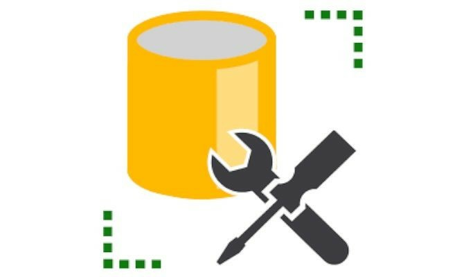

<h1 algin="left">Hello, I'm Arek. Nice to see you :)</h1>
<h3 align="left">About me</h3>

>Some facts about me.

- :mortar_board: BSc Computer Science - Warsaw University of Technology (2019-2023)
- :office: I'm currently working at BNP Paribas GSC
- :seedling: I'm learning cyber security topics
- :computer: I'm dedicated backend developer
- :purple_heart: I love all kinds of open-source
  

  
<h3 align="left">My stack</h3>

>Current technologies and tools that I work with.

<table>
  </tr>
     <td align="center" width="120">
        
         C#
      </td>
      <td align="center" width="120">
        
         SQL Server
      </td>
      <td align="center" width="120">
        
         TypeScript
      </td>
      <td align="center" width="120">
        
         React
      </td>
      <td align="center" width="120">
        
         Docker
      </td>
     </tr>
     <tr>
      <td align="center" width="120">
        
         Rider
      </td>
      <td align="center" width="120">
        
         SSMS
      </td>
      <td align="center" width="120">
        
         Postman
      </td>
            <td align="center" width="120">
        
         Powershell
      </td>
    </tr>
</table>

<h3 align="left">Worth seeing</h3>

>People worth recommending.

<table><tr>
<td width="120">

**.NET Developer** [Franciszek Wysocki](https://github.com/wysockif)

</td>
<td width="120">

**Fullstack Developer** [Adrian Milewski](https://github.com/milewsa3)

</td>
<tr>
</table>
